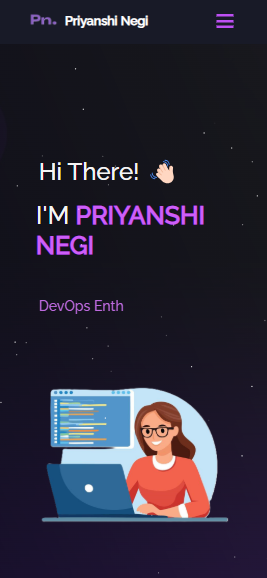

<h2 align="center">
  Priyanshi Negi | Portfolio Website - v2.0<br/>
  <a href="https://priyanshi-portfolio.vercel.app/" target="_blank">priyanshi.tech</a>
</h2>

<div align="center">
  
</div>

<br/>

<center>

[](https://forthebadge.com) &nbsp;
[](https://forthebadge.com) &nbsp;
[](https://forthebadge.com) &nbsp;
 &nbsp;


</center>

<h3 align="center">
    🔹
    <a href="https://github.com/priyanshinegi05/Portfolio/issues">Report Bug</a> &nbsp; &nbsp;
    🔹
    <a href="https://github.com/priyanshinegi05/Portfolio/issues">Request Feature</a>
</h3>

## TL;DR

This is my personal portfolio website built with **React.js** and hosted on **Vercel**.  
You’re welcome to fork this repo and customize it for yourself.  
If you do, giving a ⭐ would mean a lot! 💜  

## Built With

My portfolio <a href="https://priyanshi-portfolio.vercel.app/" target="_blank">priyanshi.tech</a> features some of my projects, skills, and interests in **Full-Stack Development, DevOps, and Global Tech/Geopolitics**.  

Technologies used:  

- React.js  
- Node.js  
- Express.js  
- CSS3 / React-Bootstrap  
- VsCode  
- Vercel  

## Features

**📖 Multi-Page Layout**  
**🎨 Styled with React-Bootstrap (easy to customize)**  
**📱 Fully Responsive**  

## Getting Started

Clone this repository. You will need `node.js` and `git` installed globally.  

## 🛠 Installation and Setup Instructions

1. Install dependencies:  
   ```bash
   npm install
